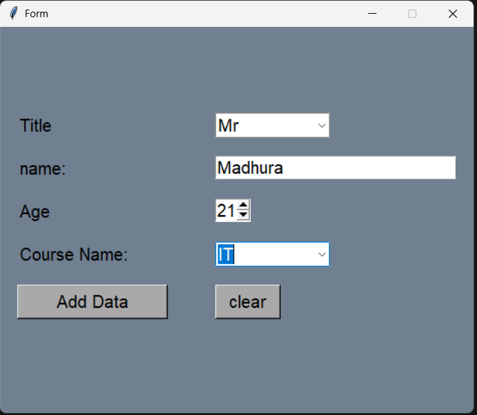

# 📝 Python Tkinter Simple Data Entry Form

A streamlined desktop Graphical User Interface (GUI) built with Python and Tkinter, designed to collect structured user data. This project serves as an excellent front-end template for future database integration.

### 📸 Application Interface


### ✨ Features
* **Advanced Input Widgets:** * Uses `ttk.Combobox` to provide clean dropdown menus for Titles and Course Names.
  * Uses `Spinbox` to easily control and restrict age input (set between 19 and 60).
* **Keyboard Shortcuts:** Built-in event binding allows users to press **`Escape`** to instantly clear all fields.
* **Custom Styling:** Features a slate gray background (`#708090`) with consistent, readable fonts across all labels and inputs.
* **Extensible Architecture:** The "Add Data" button is linked to a placeholder function, ready to be connected to a SQL database, CSV file, or external API in future updates.

### 🛠️ Built With
* **Python 3**
* **Tkinter & ttk** (Themed Tkinter for modern widgets)

### 🚀 How to Run
Since this application uses standard Python libraries, there is no need to install external packages.

1. Clone or download this repository to your local machine.
2. Open your terminal or command prompt.
3. Run the application:
   ```bash
   python Simple_form.py
